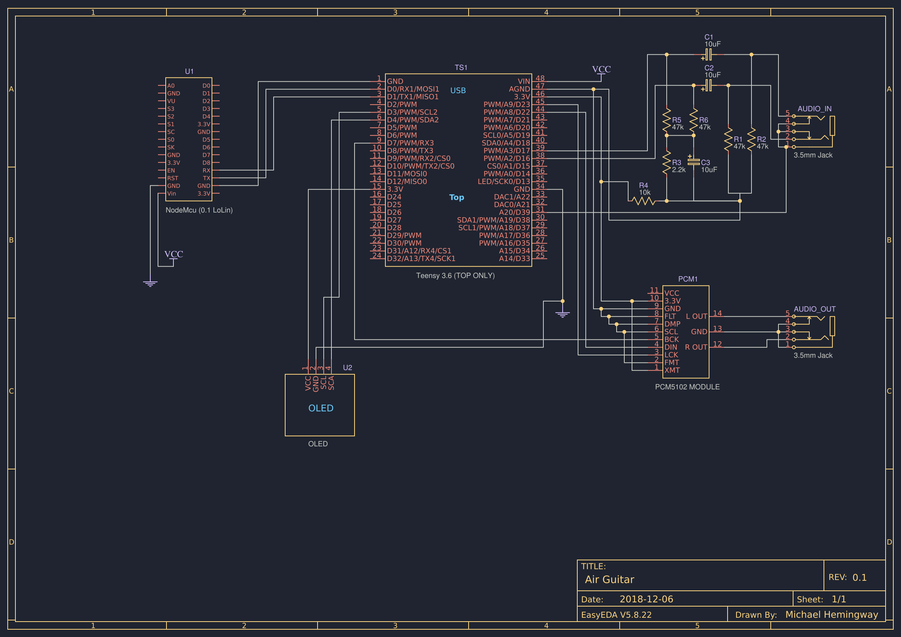

<small>Above: final schematic for the audio pedal</small>

# Air Guitar
A WiFi-enabled guitar effect pedal (stompbox) controlled not by the player, but by the audience!

## Development
Find below a development log detailing the trials and tribulations of getting this prototype very quickly off the ground.

### Conception
Development for this project started rather late in the allotted timeframe. I unfortunately only had the idea for this in the last week and a half, and I had a working prototype with all functions connected (audio in, audio out, effects and wifi control) in the last day before the project was to be submitted.

My earlier efforts still reflected an interest in audio, but were rather scattered as attempts and lacking in any real vision. I was growing very dissatisfied with my progress or lack thereof. Inspiration finally struck when I answered the question of 'what problem do I want to solve?' In retrospect, I lament the extremely technical direction I pursued, and how my limited time effectively forced me to pursue the most minimal functional prototype.

I was inspired to create a guitar pedal that would emulate many effects, and be able to be controlled remotely, so that player and audience could intereact and contribute to the music creation process. I wanted this experience for myself and my younger sister and her new electric guitar.

### CS
Chip selection was straightfoward at first. I quickly ruled out the Arduino Uno as I knew it's processing power was far too limited on its own to deal with live audio. Whilst implementations exist, all except for drum machines (which are computationally a lot more streamlined than effect pedals) added significant hardware to the Uno in service of rendering it a capable audio device.

I had available to me from a previous audio project (that I ultimately did not pursue) the Teensy 3.6 microcontroller from PJRC and the associated Teensy Audio Shield. I knew these were arduino compatible, and they were my most capable MCs save for a STM32F4 that I had not attempted to program yet, so the choice was initially obvious.

I spent an unfortunate amount of time with the STGL5000 chip and the Audio shield before realising that it was indeed dead, and that no sound will ever come out of the thing. Random noises and occasional static had kept me hopeful, yet it was likely the case that this was broken far long ago. Realising that my all-in-one audio solution would not work, I spent another unfortunate amount of time around a PCM adudio-out shield originally intended for the Rasberry Pi.

The chip had little if any documentation, and what I initially thought was an audio in was actually just a hardware passthrough - a realisation took me days to make. Faulty solder connections of mine contributed to further instability, as well as sharing the ground line of the chip with other components. I eventually isolated all the audio circuitry to its own power and ground, and my noise floor was significantly improved. Using this PCM chip gave me very high quality and low latency audio ouy, yet so far no audio in.

The 'analogRead problem' - the Teensy's ADC internally hogged most of the analog IO lines when used as an audio input, breaking when your standard analog read was called, even on seemingly unused pins - caused a small number of headaches, and pinout differences in the dedicated ADC lines across Teensys did too, yet I ultimately got the thing to read audio in via a heaphone jack with little additional hardware.

Noise with this method wasn't ideal, and was at a hard maximum of 16 bits. This isn't terrible, but effective bits were really 14 and this now was a problem to be fixed in software.

---
Having effectively built the core audio I/O, I moved onto the wireless component of the project. I had initially selected the bare (and extremely popular) ESP8266 as the complete wifi solution. However, I wondered about the power draw of this whole setup and indeed, with the planned screen I was keen on implementing, the whole setup drew well over the Teensy's 250mA rating (actual tolerance is higher, but thermal damage could occur near it's actual maximum of 500mA). And so, with the additional hurdle of programming the 8-pin chip, I moved to the NodeMCU.

I originally inteded for a screen component, and coming to the decision to use the Lolin board, I figured I would power it this way as well. The idea here being that I would separate all concerns across MCs, with the Teensy handling Audio exclusively, and the NodeMCU graphics and wifi interactivity. To my dismay wiring the SPI screen was unsuccessful. All the same, I managed at the last second to get the chips primary wifi function to work via a crude url parameter method.

The original plan (as noted in comments in the ESP8266 code) was to have the wifi chip either communicate a first time with the cellphone to establish connection with the broader internet, or to serve as the primary mode of interaction. It's unfortunate that, as I've mentioned elsewhere, I was not able to build  of a physical controller, that could be paired with a phone to then communicate with the ESP on the main pedal. This would give all the tactile goodness to the listener, and still accomplish what the screen of the cellphone does in this iteration.
I should note that the screen displayed in the schematic was not the one presented, and the arduino Uno used to drive the current oled is absent; this is due to my unfortunate frying of the original 4 pin OLED I intended to use. The only other screen I had drew too much power (and had trouble interfacing) with the ESP and Teensy.

### MISO
I'd like to think I learned from and enjoyed this class the most out of my Concordia experience. I've done little circuit stuff (and occasionally taking apart old hardware) as a hobby for a while, but this has given both the knowledge and the motivation to go for a few more ambitious projects that I'd formerly not konwn where to start with. My mastery of audio design with regards to chip building has improved, and I think I'm a little wiser to circuits and conecting ground to power. :)

### OUT
Considering my MVP, I intend to work on it further. It's a shame my little steel case didn't come in on time. When that arrives, I'll be soldering this all together and seating it in a wonderful custom stompbox.
